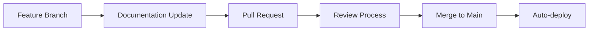

<!-- _class: lead -->

# **Software Product Documentation**
## Modern Technical Writing with Marp

### **Comprehensive Guide to Version-Controlled Documentation**

---

## **Table of Contents**

1. **Introduction to Software Documentation**
2. **Documentation Types & Best Practices**
3. **API Documentation Standards**
4. **Algorithm Complexity Analysis**
5. **Version Control Integration**
6. **Tools & Automation**
7. **Quality Assurance & Testing**
8. **Deployment & Maintenance**

<div class="footer-info">
  <a href="mailto:24f1001642@ds.study.iitm.ac.in">24f1001642@ds.study.iitm.ac.in</a>
</div>

---

<!-- _backgroundImage: url(docs-workspace.png) -->
<!-- _backgroundColor: rgba(30, 30, 30, 0.8) -->


## **Introduction to Software Documentation**

### **Why Documentation Matters**

<div class="feature-card">

- **User Experience Enhancement**: Clear documentation reduces support tickets by up to 40%
- **Development Efficiency**: Well-documented code reduces onboarding time by 60%
- **Business Value**: Good documentation increases product adoption rates by 35%
- **Maintainability**: Version-controlled docs reduce technical debt significantly

</div>

### **Key Principles**

1. **Write for your audience**: Tailor content to technical level
2. **Keep it current**: Update with every code change
3. **Use visuals**: Diagrams and screenshots improve comprehension
4. **Standardize format**: Consistent structure aids navigation
5. **Enable collaboration**: Multiple contributors enhance quality

---

## **Documentation Types & Best Practices**

### **Primary Documentation Categories**

| **Type** | **Audience** | **Purpose** | **Update Frequency** |
|:---------|:-------------|:------------|:---------------------|
| **User Guides** | End Users | Feature usage, tutorials | Per release |
| **API Docs** | Developers | Integration instructions | Per API change |
| **System Docs** | DevOps | Architecture, deployment | Per architecture change |
| **Code Comments** | Developers | Implementation details | Per code change |

### **Best Practices Framework**

- **Agile Documentation**: Just-in-time docs during development
- **Living Documents**: Continuous updates with sprints
- **Collaborative Writing**: Team documentation sprints
- **Quality Gates**: Documentation coverage checks in CI/CD

---

## **API Documentation Standards**

### **Essential API Documentation Sections**

<div class="feature-card">

1. **Authentication & Authorization**
   - API keys, OAuth flows, token management
   
2. **Endpoints & Methods**
   - RESTful paths, HTTP methods, parameter details
   
3. **Request/Response Examples**
   - Real code samples in multiple languages
   
4. **Error Handling**
   - Status codes, error messages, troubleshooting
   
5. **Rate Limiting & Quotas**
   - Usage limits, throttling information

</div>

### **Example: REST API Endpoint**

<div class="code-block">

```http
GET /api/v1/users/{userId}/profile
Authorization: Bearer {access_token}
Content-Type: application/json

Response:
{
  "id": "user123",
  "name": "John Doe",
  "email": "john@example.com",
  "created_at": "2024-01-15T10:30:00Z"
}
```

</div>

---

## **Algorithm Complexity Analysis**

### **Time Complexity Notations**

<div class="math-formula">

**Big O Notation**: $$O(g(n)) = \{f(n): \exists c > 0, n_0 > 0 \text{ such that } 0 \leq f(n) \leq c \cdot g(n) \forall n \geq n_0\}$$

**Common Complexity Classes:**
- **Constant**: $O(1)$ - Accessing array element
- **Logarithmic**: $O(\log n)$ - Binary search
- **Linear**: $O(n)$ - Array traversal
- **Linearithmic**: $O(n \log n)$ - Merge sort
- **Quadratic**: $O(n^2)$ - Bubble sort
- **Exponential**: $O(2^n)$ - Recursive Fibonacci

</div>

### **Space Complexity Analysis**

<div class="math-formula">

**Space Complexity Formula**: $$S(n) = \text{Fixed Space} + \text{Variable Space}$$

**Example - Merge Sort:**
- **Time**: $O(n \log n)$
- **Space**: $O(n)$ - Additional array needed

**Example - Quick Sort:**
- **Time**: $O(n \log n)$ average, $O(n^2)$ worst
- **Space**: $O(\log n)$ - Stack depth

</div>

---

## **Version Control Integration**

### **Git-Based Documentation Workflow**

<div class="feature-card">



</div>

### **Documentation as Code Benefits**

- **Version Tracking**: Every change is tracked and reversible
- **Collaborative Reviews**: Peer review process for documentation
- **Automated Testing**: Link validation and format checking
- **Branch Management**: Feature-specific documentation branches
- **Release Tagging**: Documentation versions aligned with software releases

### **CI/CD Integration**

<div class="code-block">

```yaml
# .github/workflows/docs.yml
name: Documentation CI
on: [push, pull_request]
jobs:
  docs-check:
    runs-on: ubuntu-latest
    steps:
      - uses: actions/checkout@v3
      - name: Validate Documentation
        run: |
          markdownlint docs/
          link-checker docs/
          spell-check docs/
```

</div>

---

## **Tools & Automation**

### **Documentation Toolchain**

| **Tool Category** | **Purpose** | **Popular Options** |
|:------------------|:------------|:--------------------|
| **Static Generators** | Build websites from Markdown | MkDocs, Docusaurus, VuePress |
| **API Documentation** | Auto-generate API docs | Swagger UI, Redoc, Postman |
| **Diagram Tools** | Create architecture diagrams | Mermaid, PlantUML, Draw.io |
| **Testing Tools** | Validate documentation | markdownlint, link-checker |

### **Automation Examples**

<div class="code-block">

```bash
# Auto-generate API documentation
swagger-codegen generate \
  -i api/swagger.yaml \
  -l html2 \
  -o docs/api/

# Validate all markdown files
find docs/ -name "*.md" -exec markdownlint {} \;

# Generate changelog from Git commits
conventional-changelog -p angular -i CHANGELOG.md -s
```

</div>

---

## **Quality Assurance & Testing**

### **Documentation Quality Metrics**

<div class="feature-card">

- **Coverage**: 80-100% of code features documented
- **Accuracy**: Technical verification against implementation
- **Readability**: Flesch Reading Ease score > 50
- **Completeness**: All parameters, return values documented
- **Consistency**: Style guide compliance 95%+

</div>

### **Testing Framework**

<div class="code-block">

```python
# Documentation testing example
import requests
import json

def test_api_documentation():
    """Test API documentation examples"""
    
    # Test authentication endpoint
    response = requests.post('/api/auth', {
        'username': 'test_user',
        'password': 'test_pass'
    })
    assert response.status_code == 200
    
    # Test documented response format
    data = response.json()
    assert 'access_token' in data
    assert 'expires_in' in data
    assert data['token_type'] == 'Bearer'
```

</div>

---

## **Deployment & Maintenance**

### **Documentation Deployment Strategies**

| **Strategy** | **Use Case** | **Tools** | **Update Frequency** |
|:-------------|:-------------|:----------|:---------------------|
| **Static Hosting** | Public docs | GitHub Pages, Netlify | Per commit |
| **Private Hosting** | Internal docs | Confluence, GitBook | Per release |
| **Hybrid Approach** | Mixed audience | Docs-as-Code + Wiki | Variable |

### **Maintenance Best Practices**

<div class="feature-card">

1. **Regular Reviews**
   - Weekly quick checks for broken links
   - Monthly content accuracy reviews
   - Quarterly comprehensive audits

2. **Automated Monitoring**
   - Link validation in CI/CD
   - Performance monitoring
   - Usage analytics tracking

3. **Feedback Loops**
   - User rating systems
   - Issue tracking integration
   - Regular stakeholder reviews

</div>

---

## **Performance Optimization**

### **Documentation Performance Metrics**

<div class="math-formula">

**Page Load Time**: $$T_{total} = T_{DNS} + T_{connect} + T_{download} + T_{render}$$

**Target Metrics:**
- **Time to First Byte**: < 200ms
- **First Contentful Paint**: < 1.5s
- **Largest Contentful Paint**: < 2.5s
- **Cumulative Layout Shift**: < 0.1

</div>

### **Optimization Techniques**

- **CDN Integration**: Global content distribution
- **Image Optimization**: WebP format, lazy loading
- **Code Splitting**: Load only necessary resources
- **Caching Strategies**: Browser and server-side caching
- **Minification**: CSS/JS compression

---

## **Security & Compliance**

### **Documentation Security Framework**

<div class="feature-card">

- **Access Control**: Role-based permissions
- **Content Security Policy**: XSS protection
- **HTTPS Enforcement**: Encryption in transit
- **Audit Logging**: Track all documentation changes
- **Data Classification**: Mark sensitive information appropriately

</div>

### **Compliance Requirements**

| **Standard** | **Requirement** | **Implementation** |
|:-------------|:----------------|:-------------------|
| **GDPR** | Data protection | Privacy policy, consent |
| **SOC 2** | Security controls | Access logging, encryption |
| **HIPAA** | Health data protection | Audit trails, encryption |
| **ISO 27001** | Information security | Risk assessment, controls |

---

## **Analytics & Continuous Improvement**

### **Documentation Analytics Framework**

<div class="math-formula">

**User Engagement Score**: $$S = \frac{\text{Page Views} \times \text{Time on Page} \times \text{Scroll Depth}}{\text{Bounce Rate}}$$

**Key Performance Indicators:**
- **Page Views**: Most/least accessed sections
- **Time on Page**: Content engagement depth
- **Search Queries**: User intent analysis
- **Click-through Rates**: Navigation effectiveness

</div>

### **Improvement Methodology**

1. **Data Collection**: Google Analytics, Hotjar, custom metrics
2. **Analysis**: User behavior patterns, content gaps
3. **Action Planning**: Prioritize improvements based on impact
4. **Implementation**: A/B testing, content updates
5. **Validation**: Measure improvement impact

---

## **Case Study: API Documentation Success**

### **Challenge**: Developer Onboarding Time

<div class="metric">
  **Problem**: 2-week average onboarding time
</div>

### **Solution**: Comprehensive Documentation Overhaul

<div class="feature-card">

- **Interactive API Explorer**: Try-before-you-implement
- **Multi-language SDKs**: JavaScript, Python, Java, Go
- **Video Tutorials**: 5-minute getting started guides
- **Code Examples**: Real-world implementation patterns
- **Community Forum**: Peer-to-peer support

</div>

### **Results**

<div class="metric">
  **Success**: 75% reduction in onboarding time (2 weeks → 3 days)
</div>

---

## **Future Trends & Emerging Technologies**

### **AI-Powered Documentation**

<div class="feature-card">

- **Natural Language Generation**: Auto-generate documentation from code
- **Intelligent Search**: Context-aware search results
- **Personalized Content**: User-specific documentation experiences
- **Chatbot Integration**: Conversational documentation assistance
- **Automated Translation**: Real-time multi-language support

</div>

### **Emerging Standards**

| **Technology** | **Impact** | **Timeline** |
|:---------------|:-----------|:-------------|
| **Voice Interfaces** | Hands-free documentation access | 2025-2026 |
| **AR/VR Documentation** | Immersive tutorials | 2026-2027 |
| **Blockchain Verification** | Immutable documentation records | 2025-2026 |
| **Quantum Computing Docs** | New complexity paradigms | 2027-2030 |

---

## **Implementation Roadmap**

### **Phase 1: Foundation (Weeks 1-4)**

<div class="code-block">

```
Week 1: Tool selection and setup
Week 2: Style guide development
Week 3: Template creation
Week 4: Team training
```

</div>

### **Phase 2: Content Development (Weeks 5-12)**

- **Weeks 5-6**: User documentation
- **Weeks 7-8**: API documentation
- **Weeks 9-10**: System documentation
- **Weeks 11-12**: Quality assurance

### **Phase 3: Automation & Optimization (Weeks 13-16)**

- **CI/CD Integration**: Automated documentation workflows
- **Performance Optimization**: Speed and accessibility improvements
- **Analytics Implementation**: Usage tracking and insights
- **Maintenance Procedures**: Long-term sustainability planning

---

## **Resources & Next Steps**

### **Essential Tools & Resources**

<div class="feature-card">

- **Documentation Platforms**: GitBook, ReadMe, Docusaurus
- **API Tools**: Swagger/OpenAPI, Postman, Insomnia
- **Diagram Tools**: Mermaid, PlantUML, Lucidchart
- **Testing Tools**: markdownlint, link-checker, spell-checker
- **Analytics**: Google Analytics, Hotjar, Mixpanel

</div>

### **Learning Resources**

- **Books**: "Docs for Developers" by Jared Bhatti et al.
- **Courses**: API Documentation course by Tom Johnson
- **Communities**: Write the Docs, API Documentation community
- **Templates**: OpenAPI specification templates
- **Examples**: Stripe, Twilio, Google APIs documentation

---

<!-- _class: lead -->

# **Thank You**
## **Questions & Discussion**

### **Contact Information**
📧 **Email**: [24f1001642@ds.study.iitm.ac.in](mailto:24f1001642@ds.study.iitm.ac.in)

🔗 **GitHub**: [github.com/Nivedita-Shill](https://github.com/Nivedita-Shill)

📚 **Documentation Portal**: [docs.example.com](https://docs.example.com)

---

<!-- _class: lead -->

# **Appendix**
## **Reference Materials & Templates**

---

## **Documentation Templates**

### **API Endpoint Template**

<div class="code-block">

```markdown
## POST /api/v1/users

Creates a new user account.

### Authentication
Bearer token required in Authorization header.

### Request Body
```json
{
  "name": "string",
  "email": "string",
  "role": "user|admin"
}
```

### Response
- `201 Created`: User created successfully
- `400 Bad Request`: Invalid input data
- `401 Unauthorized`: Authentication required
- `409 Conflict`: Email already exists

### Example
```bash
curl -X POST https://api.example.com/v1/users \\
  -H "Authorization: Bearer {token}" \\
  -H "Content-Type: application/json" \\
  -d '{"name":"John Doe","email":"john@example.com"}'
```
```

</div>

---

## **Style Guide Quick Reference**

### **Writing Guidelines**

- **Voice**: Active voice, second person (you/your)
- **Tone**: Professional, helpful, encouraging
- **Sentences**: Clear, concise, scannable
- **Paragraphs**: Maximum 3-4 sentences
- **Lists**: Use for sequences, options, and requirements

### **Formatting Standards**

<div class="code-block">

```markdown
# Main Heading (H1)
## Section Heading (H2)
### Subsection Heading (H3)

**Bold** for UI elements and important terms
*Italic* for emphasis and new concepts
`Code` for inline code and API parameters

- Bullet points for unordered lists
1. Numbered lists for sequential steps

> Blockquotes for important notes and warnings
```

</div>

---

## **Markdown Cheat Sheet**

### **Essential Markdown Syntax**

<div class="code-block">

```markdown
# Heading 1
## Heading 2
### Heading 3

**Bold Text**
*Italic Text*
`Inline Code`

[Link Text](URL)


- List item 1
- List item 2
  - Nested item

1. Numbered item 1
2. Numbered item 2

| Table | Header |
|-------|--------|
| Cell  | Data   |

\`\`\`python
# Code block
print("Hello, World!")
\`\`\`

> Blockquote
```

</div>
